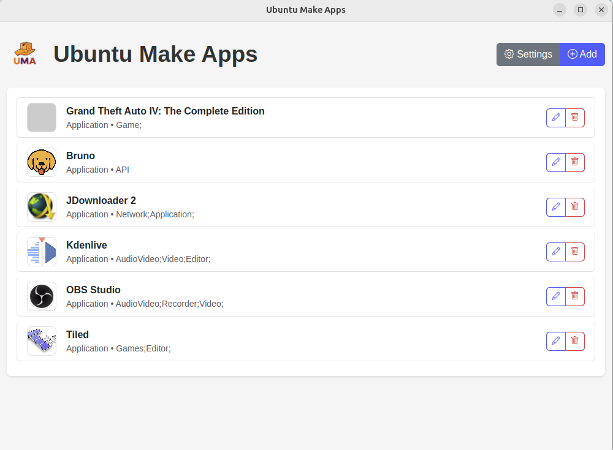

<p align="center">
  
</p>

# Ubuntu Make Apps

Electron application to easily manage your AppImage applications on Ubuntu.

<p align="center">
  
</p>

## Features

- Automatically create the `~/Applications` folder
- Manage `.desktop` files in `~/.local/share/applications/`
- Add, edit, and delete applications
- Support for AppImage files and directories
- Copy or move AppImage files
- Icon management
- Modern interface with Bootstrap 5

## Quick Installation (One-liner)

Install directly from GitHub with a single command:

```bash
curl -fsSL https://raw.githubusercontent.com/aluzed/ubuntu-make-apps/master/install.sh | bash
```

This will:

- Check system requirements (Node.js 18+, npm, git)
- Clone the repository
- Install dependencies
- Build the AppImage
- Install to ~/Applications
- Create a desktop menu entry

## Development Installation

For development purposes:

```bash
npm install
```

## Running

```bash
npm start
```

## Usage

1. **Add an application**: Click on "Add"
2. **Select the type**: Application (for AppImage) or Directory (for folder)
3. **Choose the file/folder**: Browse to select your AppImage or folder
4. **Copy or move**: A dialog will ask if you want to copy or move the file
5. **Add an icon**: Select a PNG/JPG file for the icon
6. **Fill in the information**: Name, categories
7. **Save**: The .desktop file will be created automatically

## File Structure

- `main.js`: Electron main process
- `preload.js`: Secure IPC bridge
- `index.html`: User interface
- `renderer.js`: Application logic
- `styles.css`: Custom styles

## Building

### AppImage (portable)

```bash
# Using npm
npm run build-appimage

# Using the build script
./build.sh

# Using the Makefile
make build-appimage
```

### .deb Package (Ubuntu/Debian)

```bash
# Using npm
npm run build-deb

# Using the Makefile
make build-deb
```

The packages will be created in `dist/`.

For detailed installation instructions, see [Install.md](Install.md).

## Installation

### Quick Install (Recommended)

```bash
# Build and install in one command with automatic dependency handling
./build.sh
./install.sh
```

### Alternative Methods

```bash
# Using Makefile with automatic dependency handling
make install

# Using apt (Ubuntu 18.04+)
sudo apt install ./dist/ubuntu-make-apps_1.0.0_amd64.deb

# Using gdebi (best for dependency handling)
sudo apt install gdebi
sudo gdebi dist/ubuntu-make-apps_1.0.0_amd64.deb
```

See [Install.md](Install.md) for complete installation instructions including:

- Multiple installation methods
- Manual installation from source
- Troubleshooting
- System requirements

## Technologies

- Electron
- Bootstrap 5
- SweetAlert2
- Node.js
